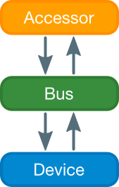
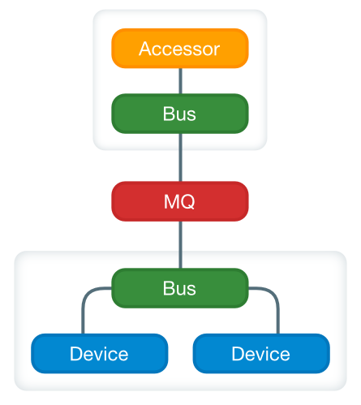

Device Control Module
===

The Device Control Module is an event handling system designed to facilitate interaction with physical devices. Some of it's features include:

 * Hub-and-spoke event bus for loose coupling
 * High-level API for issuing commands to devices
 * Low-level API for getting/setting device values
 * Support for event systems spanning many machines with message queuing
 * Designed with web services in mind
 * Built-in event filtering and device isolation


Event Bus Topology
---

### Basic Layout


The simplest layout uses a single event bus on one machine, with a java device controller operating a device. A writer will generate events, the bus will relay them to the device, the device will publish it's new state, and the reader will read and store that new state.



A few things to note:

 * Readers cache the state of a device to prevent a high volume of queries from negatively impacting the performance of a device.
 * All events contain a Device ID. This is the id of the device sending or receiving the event.
 * A framework exists to make creating a device controller simple, but anything which subscribes to an event bus can be made to control a device
 * More than one bus can be used. Events can be selectively forwarded to other busses. Be careful not to create cycles.

### Tiered Layout


To isolate your devices from the variable loads put on web servers, you can separate your system into a web tier and a device teir. These are tied together with message queueing. The Device Control Module contains built-in support for ActiveMQ, but you can also create your own adapters.



A few things to note:

 * MQ is accessed through Encoders and Decoders (not shown) which publish and subscribe to event busses like any other component.
 * The message queuing server can be on a dedicted server, or reside on either of the machines shown.


### Multi-device Layout

You may have several different devices which are logically related, but which reside on different machines. To accommodate this, the Device Control Module supports the notion of Regions. A region is a property of an event bus, and more than one bus may share a region name. 


When events are published, they contain a null region field. When an event is first published, the bus will set the region, after which, other busses the event passes through will not. This allows you to filter events coming in and out of any given bus by region, so that region-specific events can be forwarded to related busses.

Command Driven Devices (High-Level API)
---

### CommandDevice

The CommandDevice class provides an annotation-driven approach to designing device controllers which respond to a many different commands. 

Subclassing CommandDevice allows your device to respond to Commands by annotating public methods with the @CommandMethod annotation. If no name is given with the annotation, the name of the Command will be the name of the method.

```java
@CommandMethod("foo")
public void do_foo(T bar, S baz) {
	// ...
}
```

Commands can be issued with a DeviceWriter, or by setting a Command object as the payload in a DeviceEvent manually.

Note: At present, data types accepted by CommandMethods must be classes with public fields. Scalar values, such as primitives, or Strings are not accepted. This is a known limitation, and will hopefully be eliminated in the future.

### ConnectedCommandDevice

The ConnectedCommandDevice class is meant for device controllers which must maintain a persistent connection of some sort to the controlled device. 

It requires the implementation of the following methods:

```java
protected abstract void connect();
protected abstract void onConnect();
protected abstract void onDisconnect(Exception exception);
```

The connect method should create a new connection to the device. If this connection is terminated, the disconnected method should be called, which will in turn call onDisconnect, and then attempt to create a new connection.

onConnect and onDisconnect notify the subclass when a (dis)connection occurs.

### HeartbeatCommandDevice

If you require polling in order to determine if your connection is still alive, HeartbeatCommandDevice will handle some of the internals automatically. 

It builds on ConnectedCommandDevice, and requires the implementation of the following methods:

```java
public abstract boolean isDisconnected();
```

Where isDisconnected should test if the connection is still alive. If it is not, HeartbeatCommandDevice will begin the process of creating a new connection.

Simple Get/Set Devices (Low-Level API)
---

### SimpleDevice

If you want to create your own method of interacting with device controllers, you can use the low-level API. The SimpleDevice class provides a base implementation of a device with an ID. It automatically subscribes to get/set events for it's own ID. Subclassing SimpleDevice allows you to publish and consume Java objects in an unstructured way. 

It requires the implementation of the following methods:

```java
public abstract Object getValue();
public abstract void setValue(Object val);
```

### Starting From Scratch

If you want to work at an even lower level, producing and consuming DeviceEvent objects directly, you can create your own class which interacts with a DeviceEventBus directly. A simple examine of such a class is shown below.

```java

public class CustomDevice {
	
	String id;
	DeviceEventBus bus;

	public CustomDevice(String id, DeviceEventBus bus) {
		this.id = id;
		this.bus = bus;
		bus.subscribe(this::onEvent, new BooleanAndFilter(
			new DeviceIDWhitelistFilter(getId()), 
			new BackendFilter()
		));
	}

	private void onEvent(DeviceEvent e) {
		// process events here
	};

}

```

